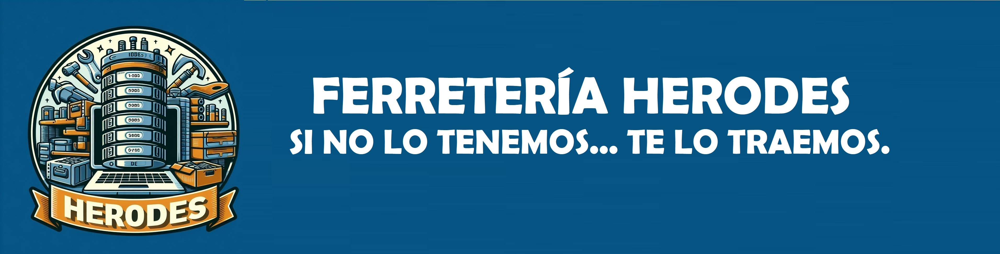

## **BASE DE DATOS - FERRETERÍA HERODES**

 **Equipo 3**, formado por: Alba María Romero, Anna Valsells, Pepe Reina y Unai Salas.

El archivo “FERRETERIA.ipynb” tiene la presentación de la base de datos.  
En la carpeta “TABLAS” están las tablas en formato excell.  
En la carpeta “JSON” están los archivos JSON de los que parte la base de datos.  
En la carpeta Database se encuentra la base de datos en formato bd.

